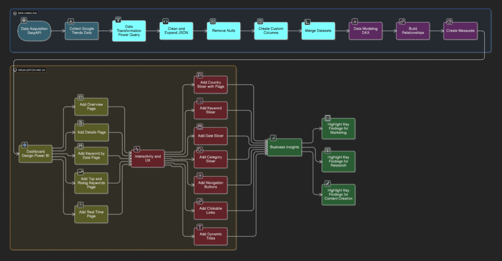
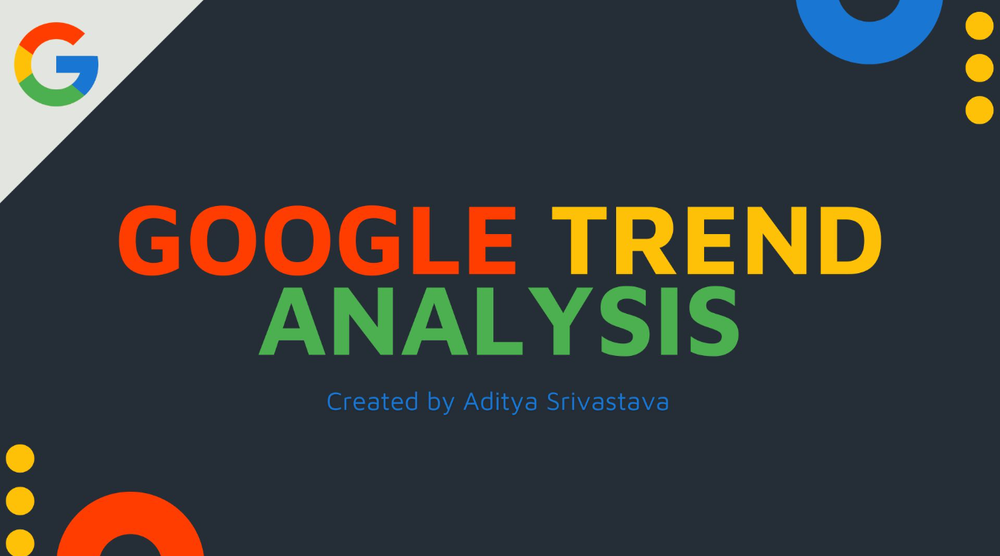
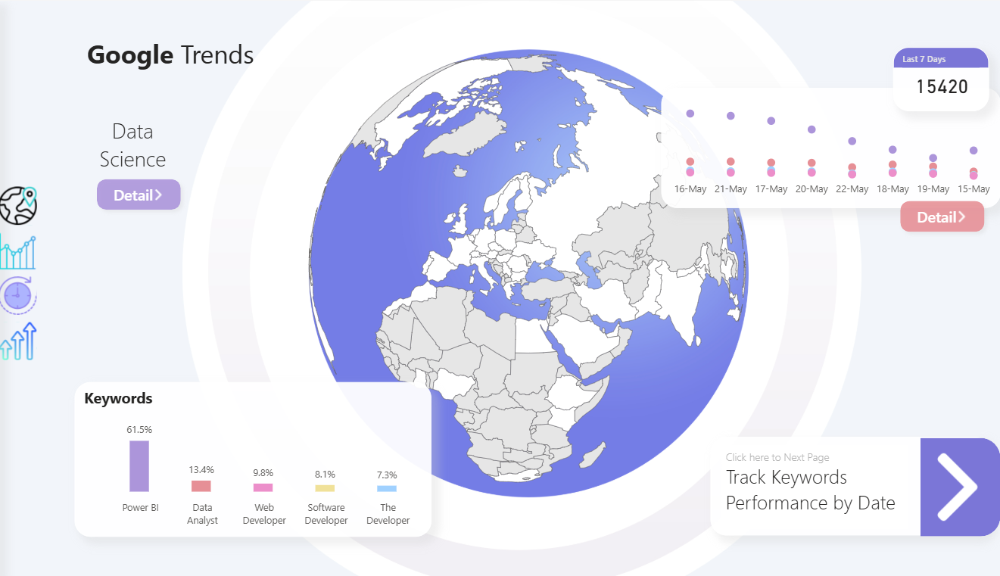
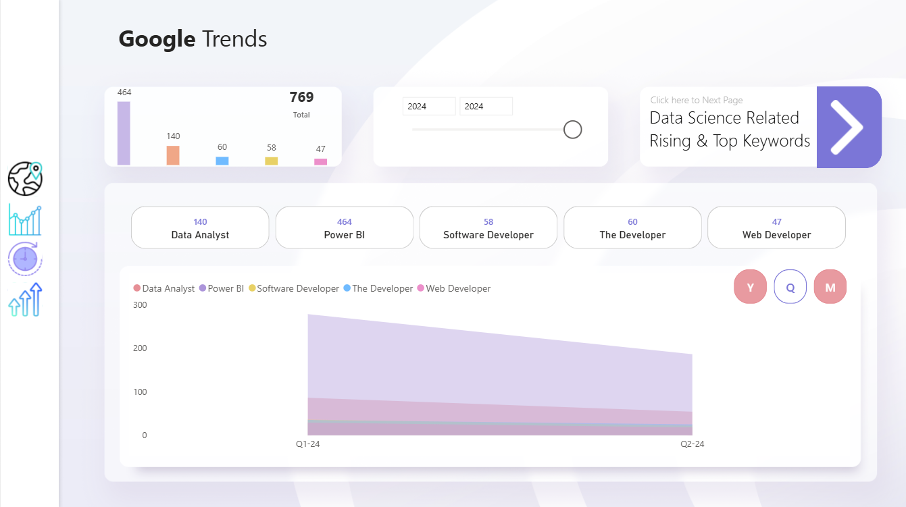
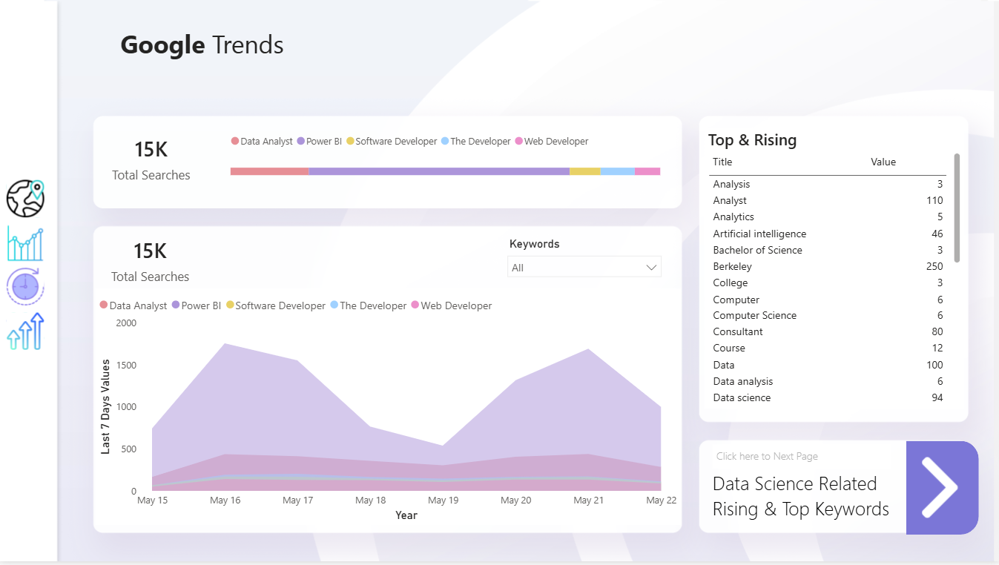
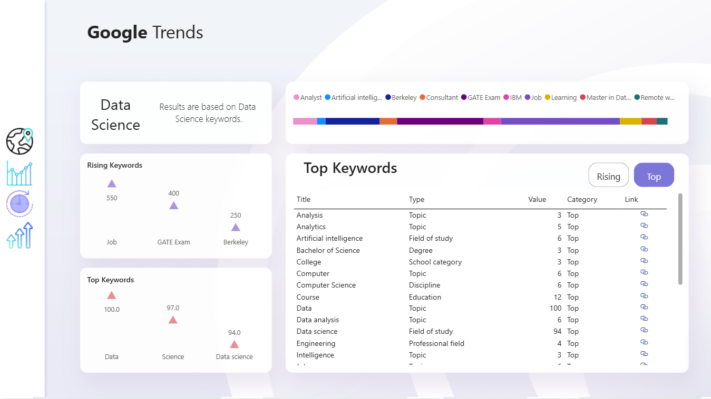

# 📊 Google Trends Analysis Dashboard (Power BI)

## 🧩 Problem Statement
Understanding how search interest evolves over time is crucial for businesses, researchers, and marketers. Google Trends provides valuable data, but it is not readily available in a dashboard format that supports dynamic filtering, country-wise analysis, and in-depth keyword exploration.  

This project bridges that gap by creating a **Google Trends Dashboard in Power BI** using the **SerpAPI**, enabling dynamic, interactive, and visually appealing insights.

---

## 🛠️ Tools & Technologies
- **Power BI** → Data modeling, visualization, and dashboard creation.  
- **Power Query (M Language)** → API integration, data transformation, and cleaning.  
- **DAX (Data Analysis Expressions)** → Measures, calculations, and dynamic insights.  
- **SerpAPI (Google Trends API)** → Fetches real-time and historical Google Trends data.  
- **Figma / Pia Pa** → Backgrounds, shapes, and design elements for a polished UI.  

---

## 🚀 Approach
1. **Data Acquisition**  
   - Connected to **SerpAPI** for fetching country-wise, date-wise, top, and rising keyword data.  
   - Used API keys with M code in Power Query for dynamic queries.  

2. **Data Transformation**  
   - Expanded nested JSON responses into structured tables.  
   - Removed irrelevant columns and handled null/negative values.  
   - Created custom columns (Month, Year, Quarter, Category, Formatted Date).  
   - Merged “Top” and “Rising” keyword datasets.  

3. **Data Modeling**  
   - Built relationships between tables.  
   - Created **DAX measures** for country contribution, last 7 days values, refresh date, and keyword-specific insights.  

4. **Dashboard Design**  
   - **Overview Page** → Map + global trends.  
   - **Details Page** → Keyword-level insights & refresh date.  
   - **Keyword by Date Page** → Search trends over time.  
   - **Top & Rising Keywords Page** → Related and trending terms.  
   - **Real-Time Page** → Last 7 days trend view.  

5. **Interactivity & User Experience**  
   - Added slicers (Country with flags, Keyword, Date, Category).  
   - Used dynamic titles and parameters for real-time filtering.  
   - Navigation buttons between pages + clickable external URLs.  
   - Custom backgrounds, gradients, and professional theme for aesthetics.

---

## 🖼️ Project Workflow  

  
  

---

---

## 📊 Dashboard Preview
*(Add your screenshots here)*  

- **Overview Page**  
  
  
  
  
         

---

## 📊 Key Insights
- Identified **regional keyword performance** with country-wise breakdown.  
- Tracked **historical keyword trends** to understand seasonality.  
- Compared **top vs rising keywords** to identify emerging search interests.  
- Analyzed **last 7 days of real-time data** for up-to-date trend monitoring.  

---

## 🌟 Business Impact
- **Marketing Teams** → Discover trending topics for ad targeting & content planning.  
- **Researchers** → Track public interest and sentiment across regions.  
- **Businesses** → Align product launches with rising consumer interests.  
- **Content Creators** → Identify hot topics to maximize engagement.  

---

## 📦 Repository Contents
📂 Google-Trend-Analysis
┣ 📂 data # Sample API responses / transformed datasets
┣ 📂 images # Dashboard screenshots
┣ 📂 pbix # Power BI project file
┣ 📜 README.md # Project documentation

---

## 🔮 Future Enhancements
- Automate API refresh with **Power BI Service** scheduled refresh.  
- Add **sentiment analysis** by combining Google Trends with Twitter API.  
- Expand coverage to include **category-specific trends** (Tech, Health, Finance).  
- Deploy dashboard online using **Power BI Embedded** for public access.  

---

## 👤 Author
**Aditya Srivastava**  
- 🎓 Student at Lovely Professional University  
- 💼 Data Analyst & Dashboard Enthusiast  
- 🌐 [LinkedIn](https://linkedin.com/in/adityasri8626) | [GitHub](https://github.com/Adityasri8626)  

---
✨ If you like this project, don’t forget to ⭐ star the repo!
